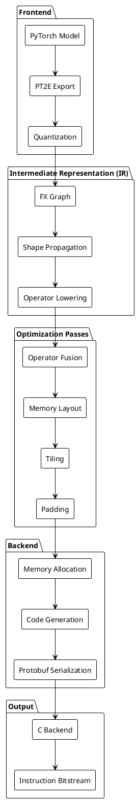
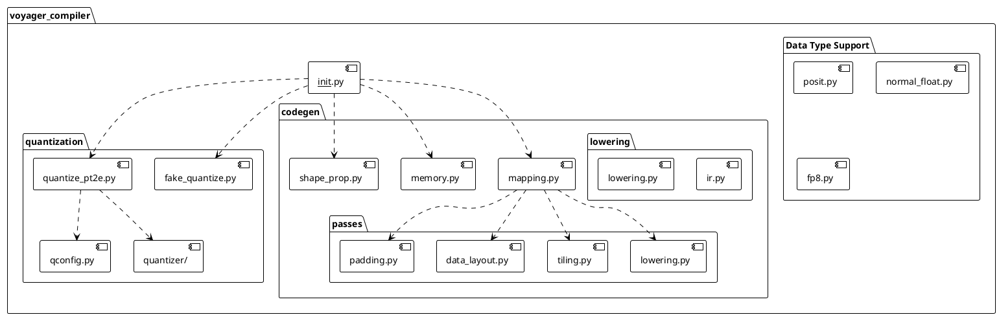
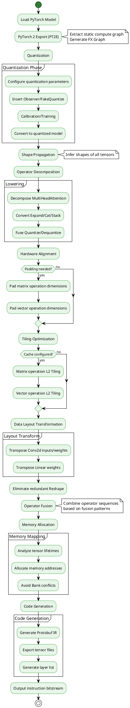
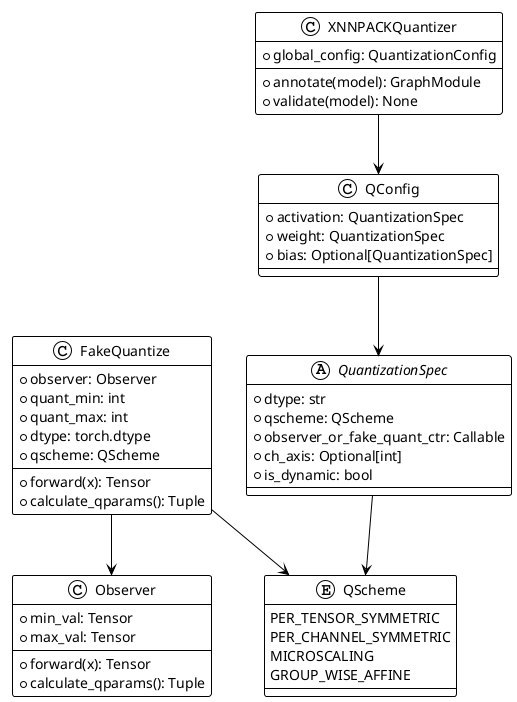
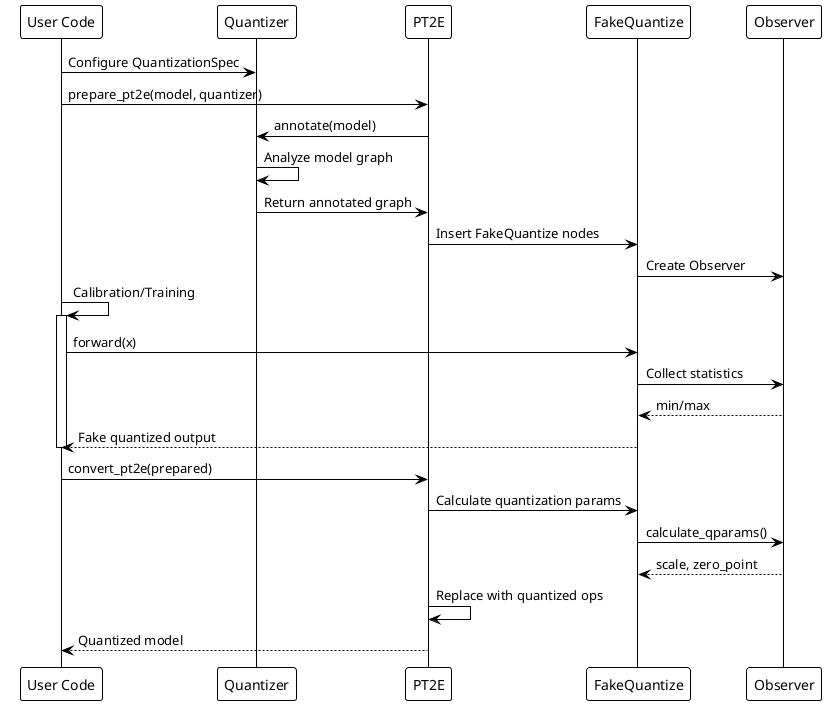

# Voyager Compiler Architecture Guide

## Table of Contents
- [Project Overview](#project-overview)
- [Design Philosophy](#design-philosophy)
- [System Architecture](#system-architecture)
- [Core Components](#core-components)
- [Compilation Pipeline](#compilation-pipeline)
- [Quantization Framework](#quantization-framework)
- [Example Applications](#example-applications)
- [Getting Started](#getting-started)

## Project Overview

Voyager Compiler is a **hardware-software co-designed** machine learning (ML) compiler that efficiently maps PyTorch models onto Voyager-generated deep neural network (DNN) accelerators.

### Key Features

- **PyTorch Native Support**: Extract static compute graphs using PyTorch 2 Export (PT2E)
- **Advanced Quantization Framework**: Support for multiple data types (low-bitwidth integers, floating point, Posit, NormalFloat)
- **Hardware-Aware Optimizations**: Operator fusion, architecture-specific optimizations, scheduling, and accelerator instruction generation
- **Flexible Intermediate Representation**: Hardware-oriented IR built on PyTorch FX graph
- **Protocol Buffers Serialization**: Consumed by C-based backend to generate final accelerator instruction bitstream

### Validated Models

- **CNNs**: ResNet, MobileNet, EfficientNet
- **Transformers**: BERT, ViT, MobileBERT
- **LLMs**: GPT-2, LLaMA
- **Detection and Sequence Models**: YOLO, Mamba

## Design Philosophy

Voyager Compiler's design is based on the following core principles:

### 1. Hardware-Software Co-optimization
The compiler is tightly coupled with hardware accelerators, ensuring generated code fully utilizes hardware features (e.g., SIMD units, systolic arrays).

### 2. Multi-stage Compilation
Adopts a multi-stage compilation pipeline, with each stage focusing on specific optimization tasks:
- **Frontend**: Model ingestion and quantization
- **Middle-end**: Operator decomposition, fusion, and optimization
- **Backend**: Memory allocation and instruction generation

### 3. Extensibility
Through registration mechanisms and plugin-based architecture, supports custom operators, quantization schemes, and optimization passes.

### 4. Fine-grained Quantization Control
Provides fine-grained quantization control, supporting advanced techniques like mixed-precision and codebook quantization.

## System Architecture

### Overall Architecture Diagram



### Module Structure Diagram



## Core Components

### 1. Quantization System

Handles model quantization with support for multiple quantization strategies and data types.

**Core Files**:
- `quantize_pt2e.py`: PT2E quantization interface
- `fake_quantize.py`: Fake quantization implementation
- `qconfig.py`: Quantization configuration management
- `quantizer/`: Quantizer implementations

**Supported Quantization Schemes**:
- Per-tensor/Per-channel symmetric quantization
- Microscaling (MX) quantization
- Group-wise Affine quantization
- Mixed-precision quantization

### 2. Operator Processing

Multiple passes for operator decomposition, fusion, and optimization.

**Core Functions**:
- **Lowering**: Decompose complex operators into simple primitives
- **Fusion**: Fuse consecutive operators to reduce memory access
- **Padding**: Align to hardware unrolling constraints
- **Tiling**: L2 cache-optimized tiling strategy

### 3. Memory Management

`memory.py` implements the memory allocator, responsible for:
- Tensor memory allocation
- Bank conflict avoidance
- Scratchpad management
- Memory snapshot and visualization

### 4. Code Generation

`mapping.py` converts optimized FX graph to Protocol Buffer format:
- Operator serialization
- Tensor metadata generation
- Instruction parameter encoding

## Compilation Pipeline

### Complete Compilation Flow Diagram



### Key Compilation Stages Explained

#### Stage 1: Frontend Processing

```python
# Example: Export and prepare model
from voyager_compiler import export_model, prepare_pt2e, get_default_quantizer

# 1. Export model
exported = export_model(model, example_inputs)

# 2. Configure quantizer
quantizer = get_default_quantizer(
    activation_qspec=QuantizationSpec(dtype="int8", qscheme="per_tensor_symmetric"),
    weight_qspec=QuantizationSpec(dtype="int8", qscheme="per_channel_symmetric")
)

# 3. Prepare quantization
prepared = prepare_pt2e(exported, quantizer)
```

#### Stage 2: Middle-end Optimization

```python
# Example: Apply optimization passes
from voyager_compiler import transform

transformed = transform(
    prepared,
    example_args,
    unroll_dims=(16, 16),      # Hardware unroll dimensions
    cache_size=65536,           # L2 cache size
    num_banks=8,                # Number of memory banks
    transform_layout=True,      # Enable layout transformation
    fuse_operator=True          # Enable operator fusion
)
```

#### Stage 3: Backend Generation

```python
# Example: Generate instructions
from voyager_compiler import compile

compile(
    transformed,
    example_args,
    total_memory=1048576,       # Total memory size
    cache_size=65536,
    num_banks=8,
    bank_width=128,
    unroll_dims=(16, 16),
    output_dir="./output",
    dump_tensors=True
)
```

## Quantization Framework

### Quantization Architecture Diagram



### Supported Data Types

| Type | File | Description |
|------|------|-------------|
| **INT8/INT4** | `fake_quantize.py` | Standard integer quantization |
| **FP8** | `fp8.py` | E4M3/E5M2 floating-point formats |
| **Posit** | `posit.py` | Configurable precision Posit numbers |
| **NormalFloat** | `normal_float.py` | Custom floating-point format |
| **MX (Microscaling)** | `mx_utils.py` | Block floating-point quantization |

### Quantization Workflow Diagram



## Example Applications

The project includes example applications across multiple domains, demonstrating Voyager Compiler's versatility.

### 1. Image Classification (ImageNet)

**Location**: `examples/imagenet/`

**Supported Models**:
- ResNet (18/34/50/101/152)
- MobileNet (v2/v3)
- EfficientNet (b0-b7)
- Vision Transformer (ViT)

**Usage Example**:

```bash
# Quantization-Aware Training (QAT)
python examples/imagenet/main.py /path/to/imagenet \
    -a mobilenet_v2 --pretrained -b 64 --lr 1e-4 \
    --bn_folding --calibration_steps 10 \
    --activation int8,qs=per_tensor_symmetric \
    --weight int8,qs=per_tensor_symmetric \
    --bias int24 --gpu 0

# Inference evaluation
python examples/imagenet/main.py /path/to/imagenet \
    -a mobilenet_v2 --pretrained --evaluate \
    --bn_folding --calibration_steps 10 \
    --activation int8,qs=per_tensor_symmetric \
    --weight int8,qs=per_tensor_symmetric \
    --bias int24 --gpu 0
```

### 2. Language Modeling

**Location**: `examples/language_modeling/`

**Supported Models**:
- GPT-2
- LLaMA
- BERT
- MobileBERT

**Features**:
- Static cache optimization
- KV-cache management
- Long sequence processing

### 3. Other Applications

| Task | Directory | Typical Models |
|------|-----------|----------------|
| **Audio Classification** | `examples/audio_classification/` | Wav2Vec2, Whisper |
| **Question Answering** | `examples/question_answering/` | BERT, RoBERTa |
| **Semantic Segmentation** | `examples/semantic_segmentation/` | SegFormer, DeepLab |
| **Speech Recognition** | `examples/speech_recognition/` | Wav2Vec2 |
| **Text Classification** | `examples/text_classification/` | BERT, DistilBERT |

### End-to-End Example

**Test File**: `test/test_codegen.py`

This file demonstrates the complete compilation flow:

```python
import voyager_compiler as vc

# 1. Load model
model = load_model("resnet18")

# 2. Prepare example inputs
example_inputs = torch.randn(1, 3, 224, 224)

# 3. Export and quantize
exported = vc.export_model(model, example_inputs)
quantizer = vc.get_default_quantizer(
    activation_qspec=int8_qspec,
    weight_qspec=int8_qspec
)
prepared = vc.prepare_pt2e(exported, quantizer)

# 4. Calibrate
calibrate(prepared, calibration_data)

# 5. Convert
converted = vc.convert_pt2e(prepared)

# 6. Optimize and transform
fusion_patterns = VECTOR_PIPELINE  # Fusion patterns
transformed = vc.transform(
    converted,
    example_inputs,
    patterns=fusion_patterns,
    unroll_dims=(16, 16),
    cache_size=65536,
    num_banks=8,
    transform_layout=True
)

# 7. Compile and generate instructions
vc.compile(
    transformed,
    example_inputs,
    total_memory=1048576,
    cache_size=65536,
    num_banks=8,
    bank_width=128,
    unroll_dims=(16, 16),
    output_dir="./output"
)
```

## Getting Started

### Environment Setup

1. **Clone the repository**:
```bash
git clone https://github.com/bushihuazai/voyager-compiler.git
cd voyager-compiler
```

2. **Install dependencies**:
```bash
pip install -e .
```

### Run Your First Example

Quick test with dummy data:

```bash
# Run ImageNet example with dummy data
python examples/imagenet/main.py \
    -a resnet18 --dummy --evaluate
```

### Understanding Code Organization

```
voyager-compiler/
├── src/voyager_compiler/          # Core compiler code
│   ├── __init__.py               # Main entry and API
│   ├── quantize_pt2e.py          # PT2E quantization
│   ├── codegen/                  # Code generation
│   │   ├── mapping.py            # IR mapping
│   │   ├── memory.py             # Memory allocation
│   │   ├── passes/               # Optimization passes
│   │   └── lowering/             # Low-level IR
│   ├── quantizer/                # Quantizers
│   └── modules/                  # Custom modules
├── examples/                      # Example applications
│   ├── imagenet/                 # Image classification
│   ├── language_modeling/        # Language models
│   └── ...
├── test/                         # Tests
│   └── test_codegen.py          # End-to-end tests
└── figures/                      # Documentation figures
    └── overview.png
```

### Debugging Tips

1. **Visualize compute graph**:
```python
from voyager_compiler.codegen import gen_compute_graph
gen_compute_graph(model, "graph.svg")
```

2. **Print node information**:
```python
from voyager_compiler import print_node_scope_tabular
print_node_scope_tabular(model)
```

3. **View memory allocation snapshot**:
```python
compile(..., dump_snapshot=True)
# Generates memory.png showing memory layout
```

## Deep Dive

### Core Concepts

1. **FX Graph**: PyTorch's intermediate representation allowing programmatic graph manipulation
2. **Observer**: Collects activation statistics during training/calibration
3. **FakeQuantize**: Simulates quantization effects while maintaining floating-point computation
4. **Tiling**: Splits large tensors into blocks to fit cache hierarchy
5. **Operator Fusion**: Merges multiple operators to reduce memory round-trips

### Extending the Compiler

#### Adding Custom Quantization Schemes

```python
from voyager_compiler import QuantizationSpec, QScheme

custom_qspec = QuantizationSpec(
    dtype="int4",
    qscheme=QScheme.PER_TENSOR_SYMMETRIC,
    observer_or_fake_quant_ctr=CustomFakeQuantize
)
```

#### Registering Custom Operator Fusion

```python
from voyager_compiler import OpMatcher

custom_pattern = [
    OpMatcher("custom_op1"),
    OpMatcher("custom_op2"),
    OpMatcher("activation")
]

transformed = transform(model, ..., patterns=[custom_pattern])
```

### Performance Tuning

1. **Adjust unroll dimensions**: Tune `unroll_dims` based on hardware SIMD width
2. **Optimize cache configuration**: Adjust `cache_size` based on L2 cache size
3. **Bank configuration**: Configure `num_banks` to avoid memory conflicts
4. **Fusion strategy**: Customize `fusion_patterns` to match hardware characteristics

## References

### Paper Citation

```bibtex
@misc{prabhu2025voyagerendtoendframeworkdesignspace,
  title={Voyager: An End-to-End Framework for Design-Space Exploration 
         and Generation of DNN Accelerators},
  author={Kartik Prabhu and Jeffrey Yu and Xinyuan Allen Pan and 
          Zhouhua Xie and Abigail Aleshire and Zihan Chen and 
          Ammar Ali Ratnani and Priyanka Raina},
  year={2025},
  eprint={2509.15205},
  archivePrefix={arXiv},
  primaryClass={cs.AR}
}
```

### Related Technologies

- [PyTorch 2 Export](https://pytorch.org/docs/stable/export.html)
- [PT2E Quantization](https://pytorch.org/ao/stable/tutorials_source/pt2e_quant_qat.html)
- [Protocol Buffers](https://github.com/protocolbuffers/protobuf)
- [PyTorch FX](https://pytorch.org/docs/stable/fx.html)

---

**Maintainer**: Jeffrey Yu (jeffreyy@stanford.edu)  
**License**: See LICENSE file  
**Version**: 0.1.dev0
