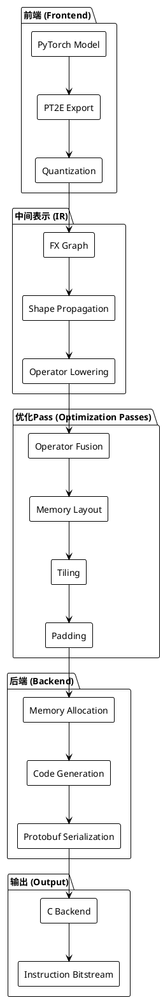
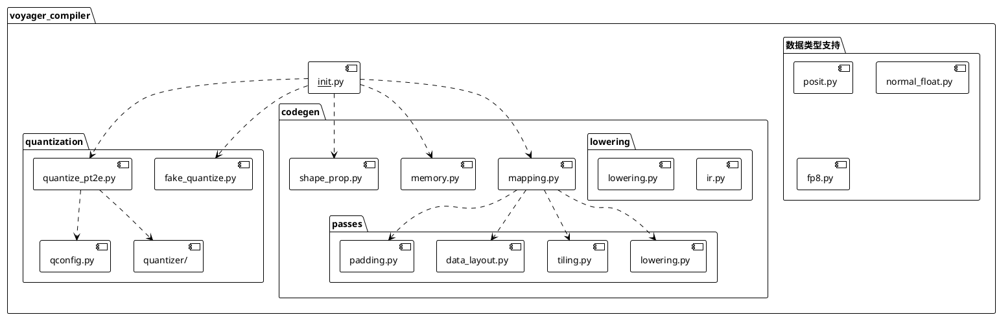
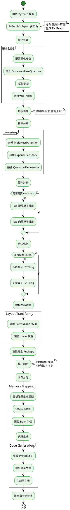
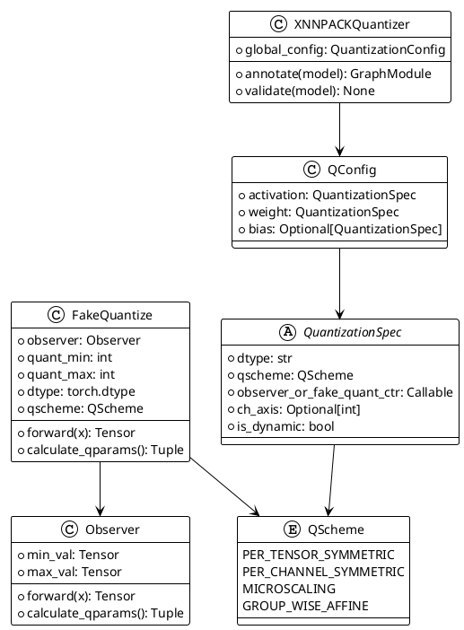
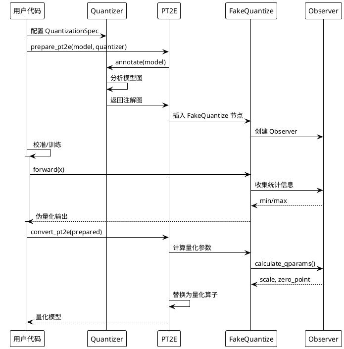

# Voyager Compiler 项目架构指南

## 目录
- [项目概述](#项目概述)
- [设计理念](#设计理念)
- [系统架构](#系统架构)
- [核心组件](#核心组件)
- [编译流程](#编译流程)
- [量化框架](#量化框架)
- [示例应用](#示例应用)
- [快速开始](#快速开始)

## 项目概述

Voyager Compiler 是一个**硬件-软件协同设计**的机器学习编译器，专门用于将 PyTorch 模型高效映射到 Voyager 生成的深度神经网络（DNN）加速器上。

### 主要特性

- **PyTorch 原生支持**：基于 PyTorch 2 Export (PT2E) 提取静态计算图
- **先进的量化框架**：支持多种数据类型（低位宽整数、浮点、Posit、NormalFloat）
- **硬件感知优化**：算子融合、架构特定优化、调度和加速器指令生成
- **灵活的中间表示**：基于 PyTorch FX 图的硬件导向 IR
- **Protocol Buffers 序列化**：通过 C 后端生成最终加速器指令比特流

### 支持的模型

- **CNNs**: ResNet, MobileNet, EfficientNet
- **Transformers**: BERT, ViT, MobileBERT
- **LLMs**: GPT-2, LLaMA
- **检测和序列模型**: YOLO, Mamba

## 设计理念

Voyager Compiler 的设计基于以下核心原则：

### 1. 硬件-软件协同优化
编译器与硬件加速器紧密结合，确保生成的代码充分利用硬件特性（如 SIMD 单元、脉动阵列等）。

### 2. 分阶段编译
采用多阶段编译流程，每个阶段专注于特定的优化任务：
- **前端**：模型导入和量化
- **中端**：算子分解、融合和优化
- **后端**：内存分配和指令生成

### 3. 可扩展性
通过注册机制和插件式架构，支持自定义算子、量化方案和优化Pass。

### 4. 精细化量化控制
提供细粒度的量化控制，支持混合精度和码本量化等高级技术。

## 系统架构

### 整体架构图



### 模块结构图



## 核心组件

### 1. 量化系统 (Quantization System)

负责模型的量化处理，支持多种量化策略和数据类型。

**核心文件**:
- `quantize_pt2e.py`: PT2E 量化接口
- `fake_quantize.py`: 伪量化实现
- `qconfig.py`: 量化配置管理
- `quantizer/`: 量化器实现

**支持的量化方案**:
- Per-tensor/Per-channel 对称量化
- Microscaling (MX) 量化
- Group-wise Affine 量化
- 混合精度量化

### 2. 算子处理 (Operator Processing)

通过多个 Pass 对算子进行分解、融合和优化。

**核心功能**:
- **Lowering**: 将复杂算子分解为简单原语
- **Fusion**: 融合连续算子以减少内存访问
- **Padding**: 对齐硬件展开约束
- **Tiling**: L2 缓存优化的分块策略

### 3. 内存管理 (Memory Management)

`memory.py` 实现了内存分配器，负责：
- 张量内存分配
- Bank 冲突避免
- Scratchpad 管理
- 内存快照和可视化

### 4. 代码生成 (Code Generation)

`mapping.py` 将优化后的 FX 图转换为 Protocol Buffer 格式：
- 算子序列化
- 张量元数据生成
- 指令参数编码

## 编译流程

### 完整编译流程图



### 关键编译阶段详解

#### 阶段 1: 前端处理

```python
# 示例：导出和准备模型
from voyager_compiler import export_model, prepare_pt2e, get_default_quantizer

# 1. 导出模型
exported = export_model(model, example_inputs)

# 2. 配置量化器
quantizer = get_default_quantizer(
    activation_qspec=QuantizationSpec(dtype="int8", qscheme="per_tensor_symmetric"),
    weight_qspec=QuantizationSpec(dtype="int8", qscheme="per_channel_symmetric")
)

# 3. 准备量化
prepared = prepare_pt2e(exported, quantizer)
```

#### 阶段 2: 中间优化

```python
# 示例：应用优化 Pass
from voyager_compiler import transform

transformed = transform(
    prepared,
    example_args,
    unroll_dims=(16, 16),      # 硬件展开维度
    cache_size=65536,           # L2 缓存大小
    num_banks=8,                # 内存 Bank 数量
    transform_layout=True,      # 启用布局转换
    fuse_operator=True          # 启用算子融合
)
```

#### 阶段 3: 后端生成

```python
# 示例：生成指令
from voyager_compiler import compile

compile(
    transformed,
    example_args,
    total_memory=1048576,       # 总内存大小
    cache_size=65536,
    num_banks=8,
    bank_width=128,
    unroll_dims=(16, 16),
    output_dir="./output",
    dump_tensors=True
)
```

## 量化框架

### 量化架构图



### 支持的数据类型

| 类型 | 文件 | 描述 |
|------|------|------|
| **INT8/INT4** | `fake_quantize.py` | 标准整数量化 |
| **FP8** | `fp8.py` | E4M3/E5M2 浮点格式 |
| **Posit** | `posit.py` | 可配置精度的 Posit 数值 |
| **NormalFloat** | `normal_float.py` | 自定义浮点格式 |
| **MX (Microscaling)** | `mx_utils.py` | 块浮点量化 |

### 量化工作流程图



## 示例应用

项目包含多个领域的示例应用，展示了 Voyager Compiler 的多样化能力。

### 1. 图像分类 (ImageNet)

**位置**: `examples/imagenet/`

**支持的模型**:
- ResNet (18/34/50/101/152)
- MobileNet (v2/v3)
- EfficientNet (b0-b7)
- Vision Transformer (ViT)

**使用示例**:

```bash
# 量化感知训练 (QAT)
python examples/imagenet/main.py /path/to/imagenet \
    -a mobilenet_v2 --pretrained -b 64 --lr 1e-4 \
    --bn_folding --calibration_steps 10 \
    --activation int8,qs=per_tensor_symmetric \
    --weight int8,qs=per_tensor_symmetric \
    --bias int24 --gpu 0

# 推理评估
python examples/imagenet/main.py /path/to/imagenet \
    -a mobilenet_v2 --pretrained --evaluate \
    --bn_folding --calibration_steps 10 \
    --activation int8,qs=per_tensor_symmetric \
    --weight int8,qs=per_tensor_symmetric \
    --bias int24 --gpu 0
```

### 2. 语言建模 (Language Modeling)

**位置**: `examples/language_modeling/`

**支持的模型**:
- GPT-2
- LLaMA
- BERT
- MobileBERT

**特性**:
- 静态缓存优化
- KV-cache 管理
- 长序列处理

### 3. 其他应用

| 任务 | 目录 | 典型模型 |
|------|------|----------|
| **音频分类** | `examples/audio_classification/` | Wav2Vec2, Whisper |
| **问答** | `examples/question_answering/` | BERT, RoBERTa |
| **语义分割** | `examples/semantic_segmentation/` | SegFormer, DeepLab |
| **语音识别** | `examples/speech_recognition/` | Wav2Vec2 |
| **文本分类** | `examples/text_classification/` | BERT, DistilBERT |

### 端到端示例

**测试文件**: `test/test_codegen.py`

这个文件展示了完整的编译流程：

```python
import voyager_compiler as vc

# 1. 加载模型
model = load_model("resnet18")

# 2. 准备示例输入
example_inputs = torch.randn(1, 3, 224, 224)

# 3. 导出和量化
exported = vc.export_model(model, example_inputs)
quantizer = vc.get_default_quantizer(
    activation_qspec=int8_qspec,
    weight_qspec=int8_qspec
)
prepared = vc.prepare_pt2e(exported, quantizer)

# 4. 校准
calibrate(prepared, calibration_data)

# 5. 转换
converted = vc.convert_pt2e(prepared)

# 6. 优化和转换
fusion_patterns = VECTOR_PIPELINE  # 融合模式
transformed = vc.transform(
    converted,
    example_inputs,
    patterns=fusion_patterns,
    unroll_dims=(16, 16),
    cache_size=65536,
    num_banks=8,
    transform_layout=True
)

# 7. 编译生成指令
vc.compile(
    transformed,
    example_inputs,
    total_memory=1048576,
    cache_size=65536,
    num_banks=8,
    bank_width=128,
    unroll_dims=(16, 16),
    output_dir="./output"
)
```

## 快速开始

### 环境准备

1. **克隆仓库**:
```bash
git clone https://github.com/bushihuazai/voyager-compiler.git
cd voyager-compiler
```

2. **安装依赖**:
```bash
pip install -e .
```

### 运行第一个示例

使用虚拟数据快速测试：

```bash
# 使用虚拟数据运行 ImageNet 示例
python examples/imagenet/main.py \
    -a resnet18 --dummy --evaluate
```

### 理解代码组织

```
voyager-compiler/
├── src/voyager_compiler/          # 核心编译器代码
│   ├── __init__.py               # 主入口和 API
│   ├── quantize_pt2e.py          # PT2E 量化
│   ├── codegen/                  # 代码生成
│   │   ├── mapping.py            # IR 映射
│   │   ├── memory.py             # 内存分配
│   │   ├── passes/               # 优化 Pass
│   │   └── lowering/             # 底层 IR
│   ├── quantizer/                # 量化器
│   └── modules/                  # 自定义模块
├── examples/                      # 示例应用
│   ├── imagenet/                 # 图像分类
│   ├── language_modeling/        # 语言模型
│   └── ...
├── test/                         # 测试
│   └── test_codegen.py          # 端到端测试
└── figures/                      # 文档图表
    └── overview.png
```

### 调试技巧

1. **可视化计算图**:
```python
from voyager_compiler.codegen import gen_compute_graph
gen_compute_graph(model, "graph.svg")
```

2. **打印节点信息**:
```python
from voyager_compiler import print_node_scope_tabular
print_node_scope_tabular(model)
```

3. **查看内存分配快照**:
```python
compile(..., dump_snapshot=True)
# 生成 memory.png 显示内存布局
```

## 深入阅读

### 核心概念

1. **FX Graph**: PyTorch 的中间表示，允许程序化操作计算图
2. **Observer**: 在训练/校准期间收集激活统计信息
3. **FakeQuantize**: 模拟量化效果但保持浮点计算
4. **Tiling**: 将大张量分块以适应缓存层次结构
5. **Operator Fusion**: 合并多个算子以减少内存往返

### 扩展编译器

#### 添加自定义量化方案

```python
from voyager_compiler import QuantizationSpec, QScheme

custom_qspec = QuantizationSpec(
    dtype="int4",
    qscheme=QScheme.PER_TENSOR_SYMMETRIC,
    observer_or_fake_quant_ctr=CustomFakeQuantize
)
```

#### 注册自定义算子融合

```python
from voyager_compiler import OpMatcher

custom_pattern = [
    OpMatcher("custom_op1"),
    OpMatcher("custom_op2"),
    OpMatcher("activation")
]

transformed = transform(model, ..., patterns=[custom_pattern])
```

### 性能调优

1. **调整展开维度**: 根据硬件 SIMD 宽度调整 `unroll_dims`
2. **优化缓存配置**: 根据 L2 缓存大小调整 `cache_size`
3. **Bank 配置**: 配置 `num_banks` 以避免内存冲突
4. **融合策略**: 自定义 `fusion_patterns` 以匹配硬件特性

## 参考资料

### 论文引用

```bibtex
@misc{prabhu2025voyagerendtoendframeworkdesignspace,
  title={Voyager: An End-to-End Framework for Design-Space Exploration 
         and Generation of DNN Accelerators},
  author={Kartik Prabhu and Jeffrey Yu and Xinyuan Allen Pan and 
          Zhouhua Xie and Abigail Aleshire and Zihan Chen and 
          Ammar Ali Ratnani and Priyanka Raina},
  year={2025},
  eprint={2509.15205},
  archivePrefix={arXiv},
  primaryClass={cs.AR}
}
```

### 相关技术

- [PyTorch 2 Export](https://pytorch.org/docs/stable/export.html)
- [PT2E Quantization](https://pytorch.org/ao/stable/tutorials_source/pt2e_quant_qat.html)
- [Protocol Buffers](https://github.com/protocolbuffers/protobuf)
- [PyTorch FX](https://pytorch.org/docs/stable/fx.html)

---

**维护者**: Jeffrey Yu (jeffreyy@stanford.edu)  
**许可证**: 参见 LICENSE 文件  
**版本**: 0.1.dev0
